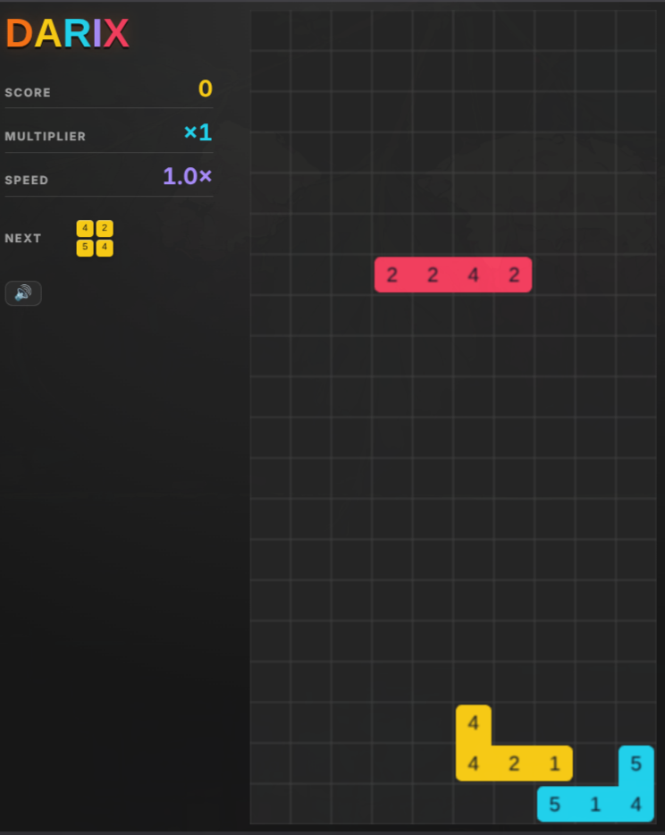

# Darix

A falling-block puzzle game where you wear pieces down by colour instead of clearing lines.

Play it: https://stezante7.github.io/Darix/

On a phone, use your browser's "Install app" or "Add to Home screen" to get it as an app. It works offline too.

## How it plays

- Every square has a number from 1 to 5: its resolve.
- When two squares of the same colour touch for the first time, both lose 1 resolve. At 0 they're destroyed and score points.
- Rotating a piece also changes its colour, so you choose what it matches.
- A piece keeps its shape until it makes a colour match. Then it breaks into loose squares that fall on their own.
- Completing a row turns the whole row the colour of the piece that completed it. The row then resolves as one big match.
- Destroying squares with colour matches on consecutive drops builds your multiplier.
- Hits speed the game up, misses slow it down.

## Controls

| Action    | Keyboard | Touch               |
|-----------|----------|---------------------|
| Start     | Space    | Tap                 |
| Move      | ← →      | Swipe sideways      |
| Rotate    | ↑        | Tap                 |
| Soft drop | ↓        | —                   |
| Hard drop | Space    | Swipe down          |
| Restart   | R        | Tap after game over |
| Mute      | M        | 🔊 button           |

## Building

You need Node.js 22.12 or newer.

    npm install
    npm run dev       # dev server with hot reload
    npm test          # run the tests
    npm run build     # type-check and build the static site into dist/
    npm run preview   # serve the built site locally

The build is a plain static site with relative paths, so `dist/` can be hosted from any folder.

Every push to `main` runs [the deploy workflow](.github/workflows/deploy.yml): it installs dependencies, runs the tests, builds, and publishes `dist/` to GitHub Pages. If the tests fail, nothing is published. The badge at the top shows the latest run.

## Credits and licence

Built with [Phaser](https://phaser.io). Sound effects and music are from Pixabay; see [CREDITS.md](CREDITS.md).

The code is under the [MIT licence](LICENSE). The audio in `public/sounds/` is not: it's covered by the Pixabay Content License.
