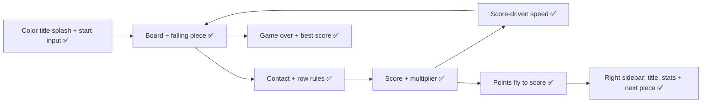

# Darix

Darix is a web-first Phaser 4 falling-block game where same-color contacts and full rows wear down per-square resolve counters, with a tighter game layout and score-driven difficulty.

## Build pieces

- [x] Phaser 4 web game shell and playable board
- [x] Falling pieces, controls, accent colors, and resolve numbers
- [x] Same-color contact and full-row resolve rules
- [x] Destroyed-square scoring, gravity, and Android-browser-friendly layout
- [x] Remove bottom buttons; keep keyboard play and use canvas gestures on touch screens
- [x] Center the playfield, prevent page scrolling, and switch to a neutral grey background
- [x] Show game over with a restart prompt
- [x] Increase fall speed as score rises
- [x] Save and display the best score on this device
- [x] Fly destroyed-square particles into the score display and count points up on arrival
- [x] Grow the multiplier on same-color destruction and reset it when a lock has no such destruction
- [x] Show best score on game over instead of the top bar
- [x] Remove the canvas frame
- [x] Move the colorful title and tagline to a click/tap/Space start splash
- [x] Put title, score, multiplier, and exact next piece in a right sidebar beside the playfield
- [x] Let the playfield use the available height and remove the bottom instruction text
- [x] Stack the compact sidebar above the playfield on narrow screens

## Out of scope for the first pass

- Native Android packaging; the first target is a responsive web game that can be played in an Android browser.
- Multiplayer and online features.
- Online or cross-device best-score synchronization.
- Lives or other mechanics shown in the visual reference but not part of Darix.

## Open questions

- The best score is stored locally in this browser; it does not sync across devices.

## Progress

- 2026-09-27: Agreed the core resolve-counter, row, and gravity behavior; implementation has not started.
- 2026-09-27: Built the Phaser 4 web prototype with keyboard/touch controls, tested board rules, scoring, and gravity.
- 2026-09-27: Agreed on this follow-up pass: remove the bottom button row, retain touch play with canvas gestures, improve the centered no-scroll layout, add a visible game-over state, ramp speed with score, and persist the best score locally.
- 2026-09-27: Implemented the layout, canvas gestures, end screen, local best score, and tested the score-based speed curve.
- 2026-09-27: Added a top score bar and aligned it with the playfield and status text in one centered column.
- 2026-09-27: Reused the game-piece accent palette in the title, score, best score, eyebrow, and status text.
- 2026-09-27: Agreed each clear should show one combined points popup, alongside a burst at the destroyed square positions.
- 2026-09-27: Resolver now reports destroyed square positions and colors; added burst effects and a floating combined points label.
- 2026-09-27: Increased the burst and score-popup size and gave the popup a visible hold before it fades.
- 2026-09-27: Agreed on a same-color destruction streak multiplier, score-flight particles that count into the HUD, and showing best score only on game over.
- 2026-09-27: Implemented the multiplier, animated point flights and score tally, and game-over best score; added resolver and multiplier tests.
- 2026-09-27: Agreed to use a full-width top HUD, an unframed grid, and a colorful initial start splash for the branding.
- 2026-09-27: Expanded the HUD bar across the viewport, removed the canvas frame, and added a multicolor title splash that pauses until click, tap, or Space.
- 2026-09-27: Agreed to move title, stats, and a next-piece preview into a left sidebar with the grid on the right, stacking on narrow screens.
- 2026-09-27: Added the responsive sidebar and a queued-piece preview with its actual colors and resolve values; tested the preview layout helper.
- 2026-09-27: Reversed the desktop columns after reviewing the rendered layout: grid left, info sidebar right; remove the bottom help text and let the grid grow with viewport height.
- 2026-09-27: Moved the sidebar right on wide screens, expanded the grid to the available height, removed bottom help text, and kept a compact stacked layout on phones.
- 2026-09-27: Simplified the two-column layout with explicit grid-template-areas to fix positioning issues; verified desktop (board left, sidebar right) and mobile (sidebar stacks above board) layouts.
- 2026-09-27: Found the real culprit: the 760px mobile breakpoint was catching desktop windows around 728 CSS px (DPR 2), so the stacked phone layout kept rendering. Dropped the breakpoint to 560px and made the sidebar column and type fluid with clamp() so two columns work from 561px up.
- 2026-09-27: Fixed a stray closing tag that pushed the board out of the layout grid; switched to a two-column layout on every screen size, with a label-free sidebar on phones; then moved the sidebar to the left.
- 2026-09-27: Agreed that pieces keep their shape unless they land on a color match, and that intact pieces fall rigidly; implemented piece groups and group-aware gravity with tests.
- 2026-09-27: Contacts now break both pieces involved (also after falling); intact pieces render as merged shapes, loose squares as tiles, with a flash-and-shards effect on break.
- 2026-09-27: Phones now show a condensed top bar (score + multiplier, title, next piece) with the board full-width below.
- 2026-09-27: Completed rows now recolor to the landing piece's color and resolve as one big match, with a row sweep effect; added sounds, speed-based music, and a remembered mute toggle.
- 2026-09-27: Phone top bar now matches the board width. Added multi-color pieces that appear more often as speed rises, with per-square colors in rotation, rows, preview and drawing.
